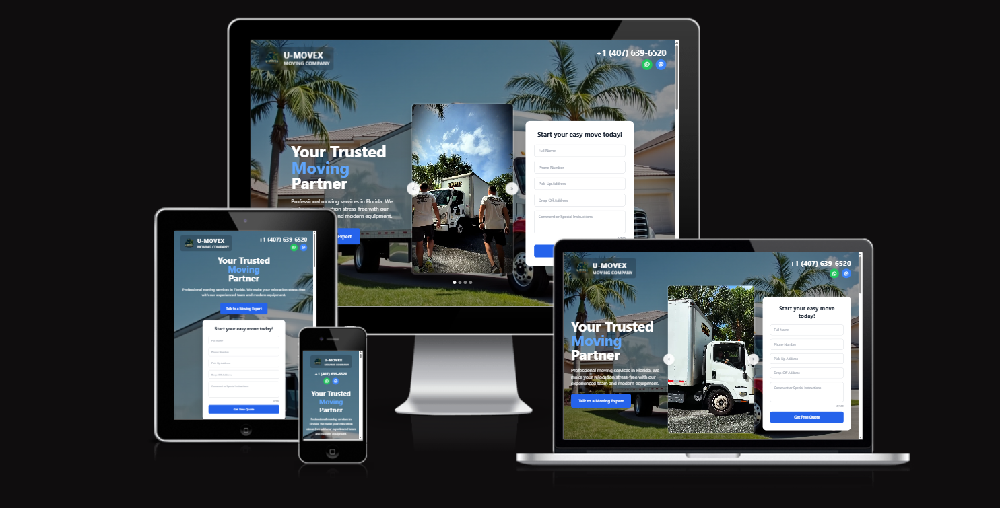

# U-Movex — Moving Company Website  

A fully responsive website for a moving services company, designed and developed **from scratch**: from concept and UI/UX design to front-end coding, deployment, and Google services integration.  

🌐 **Live demo:** [u-movex.com](https://u-movex.com)  

---

## 🚀 Features
- Modern, responsive design (desktop + mobile)  
- Service catalog with images  
- Customer reviews carousel  
- Contact form with email integration  
- Social media links (TikTok, Facebook, YouTube)  
- Optimized for SEO and fast performance  

---

## 🛠️ Tech Stack
- **Front-End:** HTML, CSS, JavaScript, React  
- **Tools:** VS Code, Git, GitHub  
- **Design:** Figma, Photoshop, AI-assisted design tools  
- **Deployment:** Domain & hosting setup, Google Analytics, Google Search Console  

---

## 📸 Screenshots

## 📂 Project Structure

